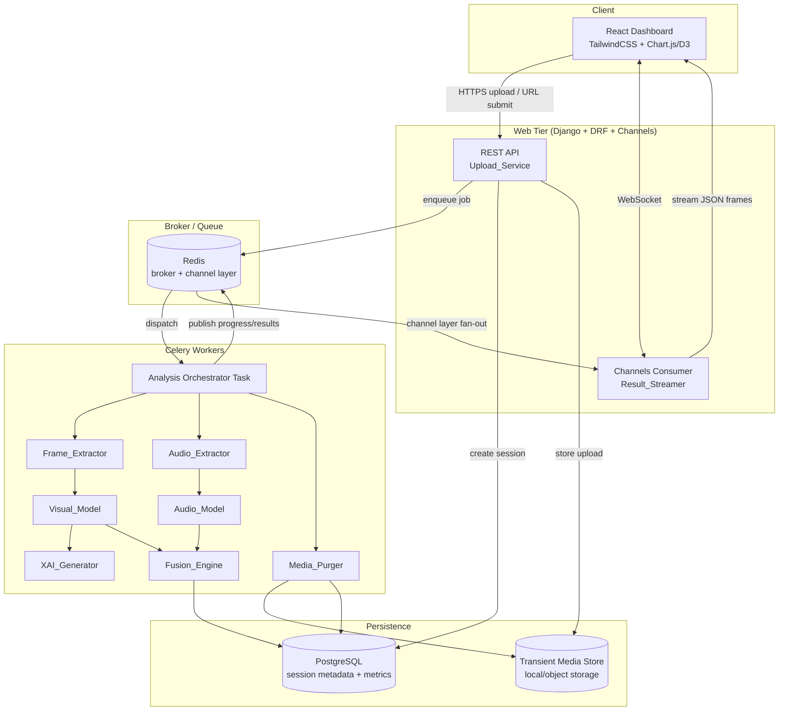
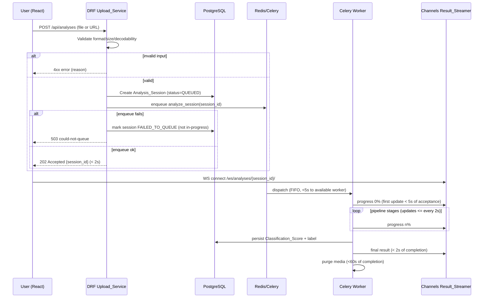
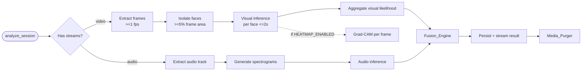

# Design Document: Real-Time Deepfake Detection Platform

## Overview

The Deepfake Detection Platform is a web application that analyzes video content for deepfake
manipulation using a multi-modal deep learning pipeline. It combines visual analysis (spatial
artifact detection on isolated facial regions) with audio analysis (synthetic-voice anomaly
detection from spectrograms), fuses the two signals into a single `Classification_Score`, and
streams progress and results to a browser dashboard over WebSockets.

The core architectural driver (NFR-03, Requirement 6) is the **decoupling of HTTP request
handling from compute-intensive ML inference**. A synchronous request/response model would time
out under PyTorch inference loads, so the design routes all heavy work through an asynchronous
task queue (Celery) backed by a message broker (Redis). The HTTP layer only validates input,
persists session metadata, and enqueues a job; the worker layer performs extraction, inference,
and fusion; and a WebSocket layer (Django Channels) streams incremental results back to the
client.

Two cross-cutting concerns shape the design:

- **Explainability (Requirement 11):** Grad-CAM heatmaps are generated from the `Visual_Model`'s
  final convolutional activations and overlaid on analyzed frames so users can see *why* a frame
  was flagged.
- **Privacy / GDPR (Requirement 9):** All media is treated as transient. The platform purges
  uploaded videos and every derived artifact within 60 seconds of session completion, retaining
  only non-media metadata (score, label, timestamps).

### Design Goals

| Goal | Driving Requirements |
|------|----------------------|
| Never block or time out the HTTP request thread on inference | 6.1, 6.2, NFR-03 |
| Near real-time feedback to the user | 5.x, 7.x |
| Resilient multi-modal analysis (one modality can fail, analysis continues) | 2.4, 2.5, 3.4, 3.5, 3.6, 4.2 |
| Deterministic, reproducible fusion and labeling | 4.1, 4.3 |
| Transient media handling with verifiable purge | 9.x |
| Trustworthy, explainable output | 11.x, 12.x |
| Meet the 85% FaceForensics++ accuracy baseline | 8.x |

### Scope and Prioritization (MoSCoW)

- **Must-Have (MVP):** Requirements 1–8 — upload, visual analysis, audio analysis, fusion,
  streaming, async processing, performance, accuracy.
- **Should-Have:** Requirement 10 (external URL input), Requirement 11 (Grad-CAM heatmaps). These
  are gated behind feature flags (`EXTERNAL_URL_ENABLED`, `HEATMAP_ENABLED`) reflected in the
  EARS `WHERE ... is enabled` preconditions.
- **Could-Have:** Requirement 12 (PDF report), gated behind `REPORT_ENABLED`.

## Architecture

### High-Level Architecture

The platform follows a layered, message-driven architecture. The HTTP/WebSocket layer is
stateless and fast; all heavy compute happens in Celery workers.



### Asynchronous Request Flow

The acceptance/acknowledgment path (Requirement 6.1) must return within 2 seconds and must not
wait for inference. The flow below shows how the request thread terminates immediately after
enqueue.



### Processing Pipeline (Celery Orchestration)

The orchestrator task coordinates the visual and audio sub-pipelines. The two modalities are
independent: a failure in one does not abort the other (Requirements 2.4, 2.5, 3.4, 3.5, 3.6).
The visual and audio branches run as a Celery `group` (parallel), joined by a `chord` callback
that performs fusion.



### Technology Mapping

| Layer | Technology | Responsibility |
|-------|-----------|----------------|
| Frontend | React.js, TailwindCSS, Chart.js/D3.js | Dashboard, real-time graphs, heatmap overlay |
| API | Django, Django REST Framework | Upload validation, session lifecycle, report endpoints |
| Realtime | Django Channels (ASGI) | WebSocket streaming, channel-layer fan-out |
| Queue/Broker | Celery + Redis | Async job dispatch, retries, FIFO scheduling, channel layer |
| ML inference | PyTorch (MPS on Apple Silicon) / TensorFlow | Visual & audio models, Grad-CAM |
| Media processing | OpenCV, FFmpeg, Librosa, MTCNN/MediaPipe | Frame extraction, face isolation, audio decode, spectrograms |
| Persistence | PostgreSQL (Django ORM) | Session metadata, evaluation metrics, report records |
| Media store | Local volume or object storage (transient) | Uploads and intermediate artifacts, purged post-analysis |

### Concurrency Model

- Worker capacity is configurable between 1 and 64 (`CELERY_WORKER_CONCURRENCY`, Requirement 6.4).
- Redis enforces FIFO dispatch; jobs beyond capacity remain queued, never dropped (6.3, 6.5).
- Each `Analysis_Session` is isolated: a unique `session_id` namespaces its media directory, its
  Channels group (`analysis_{session_id}`), and its DB record. No shared mutable state crosses
  sessions, which is what makes concurrent processing safe.

## Components and Interfaces

### Upload_Service (Requirements 1, 6, 10)

Django REST Framework views handling input intake and validation. Validation runs **before** any
session is created so that rejected inputs leave no `Analysis_Session` behind.

Validation pipeline (ordered, fail-fast):
1. **Format check** — extension and MIME/container sniff against `Supported_Format` = {MP4, AVI}.
2. **Size check** — `1 <= size_bytes <= 52,428,800`. Zero-byte → "empty file"; oversize → "50MB limit".
3. **Decodability check** — probe with FFmpeg/OpenCV; if it declares a supported format but cannot
   be decoded as a valid video, reject with "could not be read as a valid video".

Interfaces:

```python
class UploadResult(TypedDict):
    accepted: bool
    session_id: str | None        # set iff accepted
    error_code: str | None        # one of EMPTY_FILE, UNSUPPORTED_FORMAT, TOO_LARGE, UNDECODABLE
    message: str | None

class UploadService:
    def submit_file(self, upload: UploadedFile) -> UploadResult: ...
    def submit_url(self, url: str) -> UploadResult: ...   # WHERE EXTERNAL_URL_ENABLED
```

URL intake (Requirement 10) adds: scheme check (HTTP/HTTPS only), reachability with a 30s timeout,
streaming size guard that **halts retrieval** once 50MB is exceeded (6 → avoids buffering oversize
content), and a format check on retrieved content.

REST endpoints:

| Method | Path | Purpose |
|--------|------|---------|
| POST | `/api/analyses` | Submit file (multipart) or URL (json); returns `202 {session_id}` |
| GET | `/api/analyses/{id}` | Fetch session status/result metadata |
| GET | `/api/analyses/{id}/report` | Download PDF (WHERE REPORT_ENABLED) |
| GET | `/api/evaluations/{run_id}` | Retrieve persisted model evaluation metrics |

### Frame_Extractor (Requirement 2)

Uses OpenCV/FFmpeg to decode and sample frames at **≥ 1 fps** of video duration. Face isolation
uses MTCNN/MediaPipe; only regions occupying **≥ 5% of frame area** are kept as facial regions.

```python
class FrameExtractor:
    def extract_frames(self, video_path: str, min_fps: float = 1.0) -> Iterator[Frame]: ...
    def isolate_faces(self, frame: Frame, min_area_ratio: float = 0.05) -> list[FaceRegion]: ...
```

Failure handling: if extraction fails before producing any frame (2.5) or if no face is isolated
across all frames (2.4), the session is marked `no_visual_signal` and the pipeline continues with
audio. These are distinct states: `no_visual_signal` (clean) vs. `visual_error` (extraction
failure with error indication).

### Audio_Extractor (Requirement 3)

Uses FFmpeg to demux the audio track and Librosa to build mel-spectrogram representations.

```python
class AudioExtractor:
    def extract_audio(self, video_path: str) -> AudioStream | None:  # None if no audio track
    def to_spectrograms(self, audio: AudioStream) -> list[Spectrogram]: ...
```

Failure handling: no audio track (3.4) → `no_audio_signal`, continue with visual. Extraction or
spectrogram failure (3.5) or inference failure (3.6) → record `audio_error`, retain existing
session data, continue with visual.

### Visual_Model (Requirement 2)

A vision CNN/Transformer (e.g., EfficientNet/XceptionNet or a ViT) fine-tuned on FaceForensics++.
Produces a per-face likelihood in `[0.0, 1.0]` within 2s of receiving a frame (2.3), then
aggregates per-frame results into a single aggregate visual likelihood in `[0.0, 1.0]` (2.6).

```python
class VisualModel:
    def infer_face(self, face: FaceRegion) -> float:          # [0,1], <=2s
    def aggregate(self, per_frame: list[float]) -> float:     # [0,1]
```

Aggregation strategy: mean of per-frame likelihoods with an optional top-k high-confidence weighting
(configurable). The aggregate is clamped to `[0.0, 1.0]`.

### Audio_Model (Requirement 3)

A CNN over spectrogram images (or a wav2vec-style encoder) producing an audio likelihood in
`[0.0, 1.0]` (3.3).

```python
class AudioModel:
    def infer(self, spectrograms: list[Spectrogram]) -> float:  # [0,1]
```

### Fusion_Engine (Requirement 4)

Combines available modality likelihoods into a single `Classification_Score` and assigns a label.
Fusion is a **pure, deterministic function**: identical inputs always yield an identical score
(4.1).

```python
@dataclass(frozen=True)
class FusionInput:
    visual_likelihood: float | None   # None if no/failed visual signal
    audio_likelihood: float | None    # None if no/failed audio signal

@dataclass(frozen=True)
class FusionResult:
    score: float | None               # None iff inconclusive
    label: Literal["authentic", "deepfake"] | None
    modalities_used: list[str]        # subset of ["visual", "audio"]
    inconclusive: bool

class FusionEngine:
    def __init__(self, threshold: float, w_visual: float, w_audio: float): ...
    def fuse(self, inp: FusionInput) -> FusionResult: ...
```

Fusion rules:
- **Both present:** weighted combination `score = (w_v·v + w_a·a) / (w_v + w_a)`, clamped to
  `[0,1]`. Deterministic in `(v, a)`.
- **One present:** `score` derived from the available modality; `modalities_used` records which.
- **Neither present:** `score = None`, `inconclusive = True`, no modality recorded (4.4).
- **Label (4.3):** `score < threshold` → `"authentic"`; `score >= threshold` → `"deepfake"`.
  `threshold ∈ [0.0, 1.0]`, configurable.

### Result_Streamer (Requirements 5, 7, 11)

A Django Channels `AsyncWebsocketConsumer`. Each session has a channel-layer group
`analysis_{session_id}`. Workers publish events to the group via the Redis channel layer; the
consumer relays them to the connected client.

To satisfy the **resume-without-loss** requirement (5.5) and delayed-update retry (7.4), the
streamer maintains a per-session **append-only event log** (sequence-numbered events persisted in
Redis with a TTL covering the 30s reconnect window). On (re)connect, the client sends the last
`seq` it received; the consumer replays all events with `seq > last_seq` before resuming live
streaming.

WebSocket message protocol (server → client), all JSON:

```json
{ "type": "progress", "seq": 12, "session_id": "...", "percent": 45, "stage": "visual_inference", "ts": "..." }
{ "type": "heatmap",  "seq": 13, "session_id": "...", "frame_id": "f_007", "image": "data:image/png;base64,...", "intensity_scale": [0.0, 1.0] }
{ "type": "result",   "seq": 30, "session_id": "...", "score": 0.82, "label": "deepfake", "modalities_used": ["visual","audio"] }
{ "type": "error",    "seq": 31, "session_id": "...", "code": "ANALYSIS_FAILED", "message": "..." }
```

Client → server:
```json
{ "type": "resume", "last_seq": 12 }
```

Timing guarantees implemented via the orchestrator and a heartbeat:
- First progress update within 5s of acceptance (7.1) — orchestrator emits `progress 0%` as its
  first action.
- Progress updates at intervals ≤ 2s (5.3, 7.2) — a heartbeat emits the current percent if no
  stage event occurred in the interval.
- Result within 1s/2s of score production (5.4, 7.3).
- Connect within 3s with up to 3 retries (5.1, 5.2) — client-side reconnect policy.

### XAI_Generator (Requirement 11)

Generates Grad-CAM heatmaps from the `Visual_Model`'s last convolutional layer activations and
gradients w.r.t. the predicted class, normalized to `[0.0, 1.0]` and overlaid on the source frame
within 2s of classification (11.1).

```python
class XAIGenerator:
    def grad_cam(self, model: VisualModel, face: FaceRegion, frame: Frame) -> Heatmap | None: ...
```

Failure handling (11.2): retain the classification result, omit the heatmap for that frame, emit
an error indication identifying the frame. Delivery (11.3/11.4): if the Dashboard is connected,
stream within 1s; if not connected, discard the overlay (do not block subsequent results) and emit
an error indication.

### Report_Generator (Requirement 12)

Produces a single PDF (e.g., via ReportLab/WeasyPrint) for **completed** sessions only,
containing score, label, per-modality findings, and all generated heatmaps. Generation must
complete within 10s (12.1).

```python
class ReportGenerator:
    def generate(self, session_id: str) -> ReportResult:
        # if session not complete -> no PDF, message "available only after analysis completes"
        # on failure -> no partial PDF, message "report generation failed", session unchanged
```

Note: because media is purged (Requirement 9), heatmap images intended for reports are persisted
as **non-source-media report artifacts** (derived visualizations, not the original video) so that
12.3 and 9.3 coexist — see Data Models.

### Task_Queue (Requirement 6)

Celery app configured with Redis broker. Settings:
- `task_acks_late = True`, `task_reject_on_worker_lost = True` for reliability.
- `max_retries = 3` with exponential backoff (6.6).
- `worker_concurrency` configurable 1–64 (6.4).
- Default FIFO routing; jobs beyond capacity remain queued (6.3, 6.5).

### Media_Purger (Requirement 9)

Invoked on session completion, failure, or cancellation. Deletes the uploaded video and all
intermediate artifacts within 60s, verifies zero media artifacts remain, and records purge status.
Retries up to 3 times; persistent failure records a purge-failure status and raises an operator
alert (9.5).

```python
class MediaPurger:
    def purge(self, session_id: str) -> PurgeStatus:   # SUCCESS | FAILED (after 3 retries)
    def verify_empty(self, session_id: str) -> bool:   # True iff 0 media artifacts remain
```

## Data Models

### Entity Relationship Diagram

```mermaid
erDiagram
    ANALYSIS_SESSION ||--o| FUSION_RESULT : produces
    ANALYSIS_SESSION ||--o| VISUAL_RESULT : has
    ANALYSIS_SESSION ||--o| AUDIO_RESULT : has
    ANALYSIS_SESSION ||--o{ FRAME_HEATMAP : generates
    ANALYSIS_SESSION ||--o{ STREAM_EVENT : emits
    ANALYSIS_SESSION ||--o| PURGE_RECORD : purged_by
    ANALYSIS_SESSION ||--o| REPORT : exports
    MODEL_EVALUATION ||--|| EVALUATION_METRICS : records

    ANALYSIS_SESSION {
        uuid id PK
        string source_type "FILE | URL"
        string source_ref "filename or url (no media)"
        string status "QUEUED|PROCESSING|COMPLETED|FAILED|CANCELED|INCONCLUSIVE"
        string media_state "PRESENT|PURGED"
        datetime created_at
        datetime started_at
        datetime completed_at
    }
    VISUAL_RESULT {
        uuid id PK
        uuid session_id FK
        float aggregate_likelihood "[0,1] nullable"
        string state "OK|NO_VISUAL_SIGNAL|VISUAL_ERROR"
        int frames_analyzed
        int faces_isolated
        string error_detail
    }
    AUDIO_RESULT {
        uuid id PK
        uuid session_id FK
        float likelihood "[0,1] nullable"
        string state "OK|NO_AUDIO_SIGNAL|AUDIO_ERROR"
        string error_detail
    }
    FUSION_RESULT {
        uuid id PK
        uuid session_id FK
        float score "[0,1] nullable"
        string label "authentic|deepfake|null"
        string modalities_used "csv"
        bool inconclusive
        float threshold_used
    }
    FRAME_HEATMAP {
        uuid id PK
        uuid session_id FK
        string frame_id
        blob overlay_png "derived viz, not source media"
        bool delivered
    }
    STREAM_EVENT {
        uuid id PK
        uuid session_id FK
        int seq
        string type "progress|heatmap|result|error"
        json payload
        datetime ts
    }
    PURGE_RECORD {
        uuid id PK
        uuid session_id FK
        string status "SUCCESS|FAILED"
        int retries
        bool verified_empty
        datetime purged_at
    }
    REPORT {
        uuid id PK
        uuid session_id FK
        string status "AVAILABLE|FAILED"
        datetime generated_at
    }
    MODEL_EVALUATION {
        uuid run_id PK
        string dataset "FaceForensics++"
        string split "held-out test"
        float accuracy
        bool meets_baseline "accuracy >= 0.85"
        datetime evaluated_at
    }
    EVALUATION_METRICS {
        uuid id PK
        uuid run_id FK
        json confusion_matrix
        float precision
        float recall
        float f1_score
    }
```



### Key Model Notes

- **Media vs. metadata separation (9.3):** `ANALYSIS_SESSION` stores no media; `source_ref` holds a
  filename/URL string only. Actual media lives in the transient store keyed by `session_id` and is
  removed by the `Media_Purger`. After purge, only `FUSION_RESULT`, labels, and timestamps remain
  as required.
- **`FRAME_HEATMAP.overlay_png`** is a derived visualization (model activation overlay), explicitly
  classified as a non-source-media report artifact so heatmaps can persist for reports (12.3)
  without violating the GDPR media purge (9.x). This distinction is a deliberate design decision
  and should be confirmed with stakeholders during review.
- **`STREAM_EVENT`** is the append-only, sequence-numbered log enabling resume-without-loss (5.5).
  Events carry a TTL covering at least the 30s reconnect window.
- **Likelihood / score fields are nullable** to represent the no-signal and inconclusive states
  precisely rather than overloading 0.0.


## Correctness Properties

*A property is a characteristic or behavior that should hold true across all valid executions of a
system — essentially, a formal statement about what the system should do. Properties serve as the
bridge between human-readable specifications and machine-verifiable correctness guarantees.*

The following properties were derived from the acceptance criteria via the prework analysis. Pure
logic (validation, fusion, labeling, queue ordering, purge completeness, metric math, event
replay) is covered by properties below. Timing/transport criteria (5.1, 5.3, 5.4, 6.1, 7.1–7.3,
11.3), the model accuracy benchmark (8.1), and concrete network/sample-media behaviors (3.1, 5.2,
10.1, 10.2, 12.2) are covered by integration, smoke, and example tests in the Testing Strategy
rather than property-based tests. Edge cases (oversize/empty files, injected failures) are
exercised through the property generators where noted.

### Property 1: Valid uploads create exactly one session and return its id

*For any* file input whose declared format is a `Supported_Format` (MP4 or AVI), whose size is in
the inclusive range `[1, 52428800]` bytes, and which decodes as a valid video, the `Upload_Service`
SHALL accept it, create exactly one `Analysis_Session`, and return a non-null session identifier.

**Validates: Requirements 1.1, 1.6**

### Property 2: Invalid uploads are rejected with no session and a correct message

*For any* file input that is invalid for exactly one of the reasons {unsupported format, size > 50MB,
size == 0 bytes, declared-supported-but-undecodable}, the `Upload_Service` SHALL reject it, create
zero `Analysis_Session` records, and return a message identifying that specific reason (supported
formats for format errors, the 50MB limit for oversize, empty-file for zero bytes, invalid-video
for undecodable).

**Validates: Requirements 1.2, 1.3, 1.4, 1.5**

### Property 3: Frame extraction meets the minimum sampling rate

*For any* decodable video of duration `d` seconds, the `Frame_Extractor` SHALL produce at least
`floor(d)` frames (a sampling rate of at least 1 frame per second of duration).

**Validates: Requirements 2.1**

### Property 4: Face isolation respects the 5% area threshold

*For any* extracted frame containing candidate facial regions of varying sizes, the
`Frame_Extractor` SHALL isolate exactly those regions whose area is at least 5% of the frame area
and no others.

**Validates: Requirements 2.2**

### Property 5: All likelihood values fall within [0.0, 1.0]

*For any* facial region, the `Visual_Model` per-face likelihood is in `[0.0, 1.0]`; *for any* list
of per-frame likelihoods the aggregate visual likelihood is in `[0.0, 1.0]`; and *for any*
spectrogram set the `Audio_Model` likelihood is in `[0.0, 1.0]`.

**Validates: Requirements 2.3, 2.6, 3.3**

### Property 6: A missing or failed modality does not abort the other modality

*For any* `Analysis_Session` where one modality yields no signal or fails (no faces isolated /
extraction failure / no audio track / audio extraction, spectrogram, or inference failure), the
`Platform` SHALL record the corresponding modality state (no-signal vs. error), retain the existing
session data, and continue analysis with the other modality.

**Validates: Requirements 2.4, 3.4, 3.5, 3.6**

### Property 7: Spectrogram generation yields at least one representation

*For any* non-empty decoded audio stream, the `Audio_Extractor` SHALL generate at least one
spectrogram representation.

**Validates: Requirements 3.2**

### Property 8: Fusion is deterministic, range-bounded, and modality-aware

*For any* pair of optional modality likelihoods `(v, a)` in `([0,1] ∪ {None})²`: when at least one
is present the `Fusion_Engine` produces a `Classification_Score` in `[0.0, 1.0]`; repeated
invocations with identical inputs produce an identical score (determinism); `modalities_used`
contains exactly the modalities that were present; and when both are `None` the result is
`inconclusive` with no score and no recorded modality.

**Validates: Requirements 4.1, 4.2, 4.4**

### Property 9: Classification label matches the decision threshold

*For any* `Classification_Score` `s` and decision threshold `t`, both in `[0.0, 1.0]`, the assigned
label SHALL be `"authentic"` if and only if `s < t`, and `"deepfake"` if and only if `s >= t`.

**Validates: Requirements 4.3**

### Property 10: Stream replay on reconnect is lossless and gap-free

*For any* sequence of stream events with monotonically increasing sequence numbers and *any*
`last_seq` value reported by a reconnecting client, the replayed events (those with `seq > last_seq`)
concatenated with the events the client already received SHALL equal the full ordered event
sequence with no missing events and no duplicates.

**Validates: Requirements 5.5**

### Property 11: Enqueue failure never leaves a session in-progress

*For any* upload whose enqueue onto the `Task_Queue` fails, the `Platform` SHALL reject the upload,
return an error status, and leave the `Analysis_Session` in a state other than in-progress
(PROCESSING).

**Validates: Requirements 6.2**

### Property 12: Queue dispatch is FIFO and loss-free

*For any* sequence of enqueued jobs (including sequences exceeding worker capacity), every job
SHALL be dispatched exactly once and in first-in-first-out order, with no job dropped or duplicated.

**Validates: Requirements 6.3, 6.5**

### Property 13: In-progress sessions never exceed configured capacity

*For any* configured worker capacity `c` in `[1, 64]` and *any* arrival sequence of jobs, the number
of simultaneously in-progress `Analysis_Sessions` SHALL never exceed `c`.

**Validates: Requirements 6.4**

### Property 14: Job retries are capped at 3 and preserve session integrity

*For any* analysis job that fails repeatedly, the `Platform` SHALL attempt it at most 4 times (1
initial + up to 3 retries); upon exhausting retries it SHALL record a failure and preserve the
`Analysis_Session` record with no partial or corrupt results.

**Validates: Requirements 6.6**

### Property 15: Media purge removes all media artifacts across all triggers

*For any* `Analysis_Session` with any set of media artifacts (uploaded video plus intermediate
artifacts), after a purge triggered by completion, failure, or cancellation, zero media artifacts
derived from that session SHALL remain in storage and the purge-completion verification SHALL report
success.

**Validates: Requirements 9.1, 9.2, 9.4**

### Property 16: Only non-media metadata is retained after purge

*For any* purged `Analysis_Session`, the data retained by the `Platform` SHALL consist solely of the
`Classification_Score`, the classification label, and session timestamps, and SHALL contain no media
artifacts or references to media.

**Validates: Requirements 9.3**

### Property 17: Evaluation metrics satisfy their mathematical relationships

*For any* confusion matrix, the derived accuracy, precision, recall, and F1-score SHALL each lie in
`[0.0, 1.0]` and SHALL satisfy their defining relationships (e.g., F1 is the harmonic mean of
precision and recall; accuracy equals correct predictions over total).

**Validates: Requirements 8.2**

### Property 18: Evaluation metrics persist and round-trip

*For any* recorded evaluation-metrics object, persisting it and then retrieving it SHALL yield an
equal metrics object.

**Validates: Requirements 8.3**

### Property 19: Baseline flag reflects the 85% threshold

*For any* measured accuracy `acc` in `[0.0, 1.0]`, the `Platform` SHALL flag the model as meeting the
baseline if and only if `acc >= 0.85`, and when below the baseline SHALL report both the measured
accuracy and the failed threshold.

**Validates: Requirements 8.1, 8.4**

### Property 20: Grad-CAM heatmaps are normalized to [0.0, 1.0]

*For any* model activation map produced for a classified frame, the generated Grad-CAM heatmap
intensities SHALL all lie in the inclusive range `[0.0, 1.0]` across the frame's pixels.

**Validates: Requirements 11.1**

### Property 21: Non-HTTP(S) URL schemes are rejected with scheme guidance

*For any* submitted URL whose scheme is not HTTP or HTTPS, the `Upload_Service` SHALL reject the
input and return a message identifying the accepted URL schemes.

**Validates: Requirements 10.3**

### Property 22: Reports for completed sessions contain required content; incomplete sessions are refused

*For any* completed `Analysis_Session`, the generated PDF SHALL contain the `Classification_Score`,
the classification label, the per-modality findings for every modality analyzed, and every generated
Grad-CAM heatmap; and *for any* `Analysis_Session` that is not complete, the `Report_Generator` SHALL
produce no PDF and return a message indicating the report is available only after analysis completes.

**Validates: Requirements 12.1, 12.3, 12.4**

## Error Handling

The platform's error strategy is built around two principles: **partial-failure resilience** (one
failing modality or transport hiccup must not destroy the whole analysis) and **no partial/corrupt
state** (a failed job leaves a clean, well-defined record).

### Input Validation Errors (Requirements 1, 10)

Handled synchronously in the `Upload_Service` before any session is created. Each returns a typed
error code and human-readable message; no `Analysis_Session` is created on rejection.

| Condition | Code | Message theme |
|-----------|------|---------------|
| Unsupported format | `UNSUPPORTED_FORMAT` | Lists MP4, AVI |
| Size > 50MB | `TOO_LARGE` | States 50MB limit |
| Zero bytes | `EMPTY_FILE` | States file is empty |
| Declared-supported but undecodable | `UNDECODABLE` | Could not be read as valid video |
| Non-HTTP(S) scheme | `BAD_SCHEME` | Lists accepted schemes |
| URL unreachable / no content (30s) | `URL_UNREACHABLE` | Could not retrieve video |
| Retrieved oversize (halt download) | `TOO_LARGE` | States 50MB limit |

### Modality Failures (Requirements 2, 3)

Visual and audio sub-pipelines fail independently and are caught at the orchestrator boundary:
- `NO_VISUAL_SIGNAL` / `NO_AUDIO_SIGNAL`: clean "no data" states; the other modality proceeds and
  fusion uses single-modality logic.
- `VISUAL_ERROR` / `AUDIO_ERROR`: failure states with an error detail; existing session data is
  retained and the other modality proceeds.
- If both modalities are absent, fusion marks the session `INCONCLUSIVE` (no score).

### Task Queue and Worker Failures (Requirement 6)

- **Enqueue failure (6.2):** upload rejected; session never enters PROCESSING.
- **Job failure (6.6):** Celery retries with exponential backoff, capped at 3 retries. On
  exhaustion, the orchestrator wraps the result in a clean FAILED record (no partial fields written)
  and streams an `error` event to the Dashboard within 5s.
- `task_acks_late` ensures a job killed mid-flight (worker crash) is redelivered rather than lost.

### Streaming Failures (Requirements 5, 7, 11)

- **Connect failure (5.1, 5.2):** client retries up to 3 times within the 3s window, then surfaces
  an error indication.
- **Transmission delay (7.4):** the streamer retries a delayed update up to 3 times, shows a
  "updates delayed" indication, and retains session state for resumed streaming.
- **Interruption (5.5):** the sequence-numbered event log lets a client reconnect within 30s and
  replay missed events with no loss.
- **Heatmap with no client (11.4):** overlay discarded without blocking subsequent results; error
  indication emitted.

### Media Purge Failures (Requirement 9)

If verification finds residual artifacts, the `Media_Purger` retries up to 3 times. Persistent
failure records a `FAILED` purge status naming the affected session and raises an operator alert
(e.g., logged error + monitoring signal). This is a privacy-critical path and is alerted rather than
silently swallowed.

### Report Failures (Requirement 12)

- Incomplete session: no PDF; message that the report is available only after completion.
- Generation failure: no partial PDF delivered; failure message returned; session data unchanged.

## Testing Strategy

The strategy combines **property-based tests** (universal logic), **example/unit tests** (specific
behaviors and edge cases), **integration tests** (transport, timing, wiring), **model evaluation**
(accuracy benchmark), and **black-box UAT** (heatmap interpretability and dashboard usability),
matching the SDLC plan's white-box / integration / model-evaluation / black-box phases.

### Property-Based Tests

- **Library:** [Hypothesis](https://hypothesis.readthedocs.io/) for Python (backend logic) and
  [fast-check](https://github.com/dubzzz/fast-check) for the React/TypeScript event-replay logic.
- **Do not** implement a property-testing framework from scratch.
- **Minimum 100 iterations** per property test.
- Each property test is tagged with a comment referencing its design property in the format:
  **Feature: deepfake-detection-platform, Property {number}: {property_text}**
- Each correctness property (1–22) is implemented by a **single** property-based test.
- Generators are designed to cover edge cases inside the property space: zero-byte and oversize
  files (Property 2), sub-5% face boxes (Property 4), `None` modality inputs (Property 8), job
  sequences exceeding capacity (Properties 12, 13), repeated failures (Property 14), and varied
  artifact sets and purge triggers (Property 15).
- ML model inference is **mocked** in property tests (deterministic stub returning values in
  `[0,1]`) so fusion, labeling, range, and pipeline-control properties run cheaply at 100+
  iterations without invoking PyTorch.

### Unit / Example Tests (White-Box)

Using `pytest` for Django API routes, extraction scripts, and Celery tasks:
- Specific upload examples per error code (Requirement 1, 10 edge cases).
- Sample-media audio extraction (3.1), URL retrieval success path (10.1, 10.2).
- Injected-failure edge cases: 2.5, 3.5, 3.6, 7.4, 9.5, 10.4, 10.5, 10.6, 11.2, 11.4, 12.5.
- Report availability after generation (12.2).

### Integration Tests

Verifying wiring and timing (not suitable for PBT):
- Django Channels ↔ React WebSocket connection establishment < 3s (5.1) and retry behavior (5.2).
- Progress-update interval ≤ 2s (5.3, 7.2), first update ≤ 5s (7.1), result delivery ≤ 1s/2s
  (5.4, 7.3), heatmap delivery ≤ 1s (11.3).
- Acceptance/ack returns < 2s without waiting for inference (6.1); FIFO dispatch timing (6.3).
- End-to-end happy path: upload → worker pipeline → streamed result → media purged.
- Media purge timing within 60s (9.1, 9.2).

### Model Evaluation (Requirement 8)

- Benchmark the multi-modal pipeline against the **held-out FaceForensics++ test split**.
- Smoke check: accuracy ≥ 85% (8.1) — single authoritative evaluation run.
- Compute and persist confusion matrix, accuracy, precision, recall, F1 (8.2, 8.3); verify the
  baseline flag (8.4). The metric *computation* and *persistence round-trip* are additionally
  covered by Properties 17–19.

### Black-Box / Usability Testing (UAT)

- Structured UAT sessions evaluating Grad-CAM heatmap interpretability and dashboard ease of use,
  conducted after ethical approval per the SDLC plan. These cover the non-computable experiential
  criteria not addressed by automated tests.

### Coverage Summary

| Requirement | Primary Test Type |
|-------------|-------------------|
| 1 (upload) | Properties 1–2 + unit edge cases |
| 2 (visual) | Properties 3–6 + edge case 2.5 |
| 3 (audio) | Properties 5–7 + edge cases 3.5/3.6 + example 3.1 |
| 4 (fusion) | Properties 8–9 |
| 5 (streaming) | Property 10 + integration (5.1–5.4) |
| 6 (async) | Properties 11–14 + integration (6.1, 6.3) |
| 7 (performance) | Integration timing (7.1–7.3) + edge 7.4 |
| 8 (accuracy) | Smoke (8.1) + Properties 17–19 |
| 9 (GDPR purge) | Properties 15–16 + integration timing + edge 9.5 |
| 10 (URL) | Property 21 + examples/edges (10.1–10.6) |
| 11 (Grad-CAM) | Property 20 + edges (11.2, 11.4) + integration 11.3 |
| 12 (PDF report) | Property 22 + examples/edges (12.2, 12.5) |
